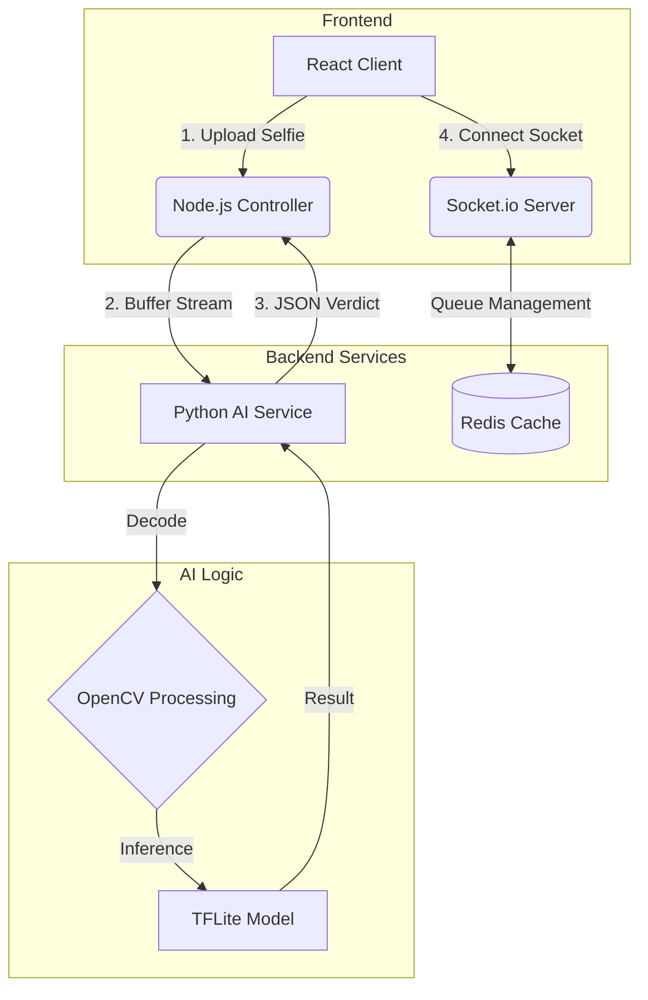

# 🕵️ ZeroTrace - Controlled Anonymity Platform

>  A real-time chat platform balancing absolute anonymity with strict safety protocols using Ephemeral Verification.


Live Demo: https://zero-trace-three.vercel.app/

## 📖 Overview
**ZeroTrace** resolves the conflict between *Privacy* and *Safety* in anonymous chats. Unlike apps that require phone numbers (Too Intrusive) or allow unregulated bots (Too Unsafe), ZeroTrace uses a **"Trustless Trust" architecture**:

1. **Identity:** Verified via biometric AI (Gender & Liveness) without storing a single byte of personal data on disk.
2. **Tracking:** No Login required. We use seeded browser device fingerprinting to enforce fair use policies.
3. **Chat:** WebSocket connections are ephemeral. Chat logs are held in volatile RAM only and vanish upon session termination.

---

## 🏗️ System Architecture

Our "Hybrid-Microservice" architecture handles high-concurrency matchmaking via Node.js/Redis while offloading heavy biometric computation to a persistent Python worker.



## ⚡ The "Queue + Socket" Flow (Matchmaking Logic)

To solve the scalability issues of MongoDB, we implement Redis Sets for O(1) matching speed.

1. **Join:** User A connects. Node generates a Hash `uid = hash(device_id + salt)`.
2. **Rate Limit Check:** Redis checks `get(daily_limit:uid)`. If < 5, proceed.
3. **Atomic Push:** User is pushed to a gender set: `SADD queue:male {socket_id}`.
4. **Atomic Match:**
   - User B searches for a match.
   - System executes `SPOP queue:male` (Returns & Removes a random ID instantly).
   - **Robustness:** If the popped socket is "dead" (ghost connection), the logic recursively pops again until a live peer is found.
5. **Room Creation:** Both sockets join a UUID room `join(room_id)`. Messaging flows directly through WebSockets; no message is ever written to a DB.

## 🔐 The "Delete-After-Verify" Protocol (Privacy Logic)

We adhere to a strict "Zero Retention" policy. We prove this via our Memory Pipeline:

### 1. The RAM Barrier

We use Multer MemoryStorage in Express. Incoming images are stored in a JavaScript Buffer object (`req.file.buffer`), never written to `uploads/` folder or S3.

### 2. The Piping Mechanism

Instead of saving a file to pass to Python, we pass the image as binary data via HTTP stream to a local Python FastAPI microservice.

**Visualizing the flow:**

```
Browser Camera -> React Memory -> Node Buffer -> Python BytesIO -> TFLite -> DELETION
```

Once the gender confidence score (0-1.0) is returned, the buffer variables are explicitly garbage collected. If the server power cord is pulled during verification, no user photos exist on the hard drive.

## 🧩 Device ID Implementation (Abuse Prevention)

Since we do not ask for Email/Phone, we rely on Seeded Fingerprinting.

- **FingerprintJS:** Collects 30+ data points (Screen Resolution, GPU, OS, Timezone, User-Agent).
- **The Hashing Strategy:** We do not store raw fingerprints (which can be used to track users across the web).
- **Storage:** The User ID is stored in the browser's LocalStorage.
- **Enforcement:** This ID is used to Key Daily Rate Limits and Shadowban Sets in Redis/Mongo. If a user acts maliciously, we ban the Device ID, rendering their anonymity useless for abuse.

## 🛠️ Tech Stack & Decisions

| Component | Tech | Why this choice? |
|-----------|------|------------------|
| Frontend | React (Vite) + Tailwind | Client-side "Liveness Check" using face-api.js (Smile to Verify). |
| Backend Core | Node.js (Express) | High concurrency I/O for WebSocket connections. |
| AI Service | Python (FastAPI) | Hosting GoogleNet/TFLite (2MB Model) for low-latency (<200ms) detection. |
| Matchmaker | Redis | Atomic operations (SPOP) prevents race conditions better than SQL. |
| Metadata | Redis | Stores only device fingerprints and ban hashes (No User Data). |

## 🚀 Getting Started

### Prerequisites

- Node.js
- Python
- Redis Server (Running on localhost or cloud)

### 1. Installation

```bash
# Clone Repo
git clone https://github.com/your-username/zerotrace.git
cd zerotrace

# Install Server Dependencies
cd server
npm install

# Install AI Service Dependencies
cd ../ai_service
pip install -r requirements.txt
```

### 2. Configuration (.env)

Create a `.env` file in the server directory:

```env
PORT=5000
REDIS_HOST=redis_cloud_url
JWT_SECRET=super_secret_ephemeral_key
```

Create a `.env` file in the client directory:

```env
VITE_API_URL=localhost:5000
```

### 3. Run the System

**Step A: Start the AI Worker** (Loads TFLite model into RAM)

```bash
# In /ai_service directory
uvicorn main:app --port 8000
```

**Step B: Start the Backend** (Express + Socket.io)

```bash
# In /server directory
npm run dev
```

**Step C: Start Frontend**

```bash
# In /client directory
npm run dev
```

## ✨ Features

- **Matching & Queue Logic:** Implemented Recursive SPOP in Redis for instant, thread-safe pairing.
- **Privacy & Data Handling:** Zero-Disk retention. Image buffers are flushed from RAM immediately after interference.
- **Gender Verification Flow:** Client-side Liveness check (Anti-spoofing) + Server-side AI check.
- **UX & Flow:** Seamless "Smile-to-Verify" onboarding (no buttons required).
- **Architecture:** Microservices approach separating Logic (Node) from Compute (Python).
